<div align="center">

# MEHFOOZ &nbsp;·&nbsp; محفوظ

### The 30-day clock that doesn't stop

**Statutory case-accountability for Pakistan's workplace-harassment law — built on [Fastn](https://fastn.ai).**

*Mehfooz* (محفوظ) means *"protected"*.

<br/>


<br/>

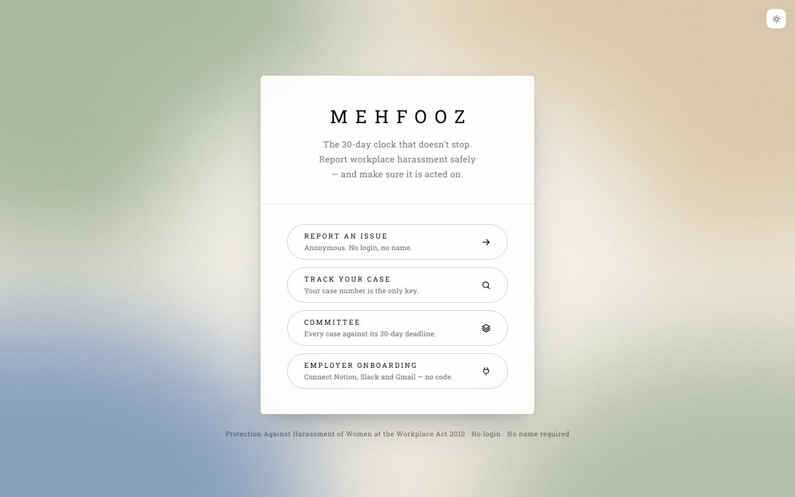

</div>

<br/>

> [!NOTE]
> **🏆 Mehfooz won 2nd Runner-Up at the *BUILD with Fastn* Hackathon** — organised by the **Microsoft Learn
> Student Ambassadors (MLSA) Islamabad Chapter** together with **Fastn**, held on **19 September 2026** at
> **SEECS, NUST, Islamabad**. It was designed, built, tested and demoed in a single day by team
> **404 Team Not Found**.

---

## Table of contents

- [The hackathon](#-the-hackathon)
- [The team](#-the-team)
- [The problem](#-the-problem)
- [What Mehfooz does](#-what-mehfooz-does)
- [Demo video](#-demo-video)
- [Screenshots](#-screenshots)
- [Architecture](#-architecture)
- [Built on Fastn](#-built-on-fastn)
- [Reliability — it never fails silently](#-reliability--it-never-fails-silently)
- [Privacy and security](#-privacy-and-security)
- [Testing](#-testing)
- [Run it locally](#-run-it-locally)
- [Repository structure](#-repository-structure)
- [Limitations](#-limitations)
- [Roadmap](#-roadmap)
- [Acknowledgements](#-acknowledgements)

---

## 🏆 The hackathon

| | |
|---|---|
| **Event** | **BUILD with Fastn** — a one-day build hackathon |
| **Organised by** | **Microsoft Learn Student Ambassadors (MLSA) — Islamabad Chapter**, in collaboration with **Fastn** |
| **Date** | **19 September 2026** |
| **Venue** | **SEECS — School of Electrical Engineering and Computer Science, NUST, Islamabad, Pakistan** |
| **Challenge** | Build a **customer-facing solution** on Fastn, where a customer connects their own accounts through ready-made connectors with no code — driven through the **Fastn MCP** |
| **Our result** | 🥉 **2nd Runner-Up** — team **404 Team Not Found** |

<div align="center">
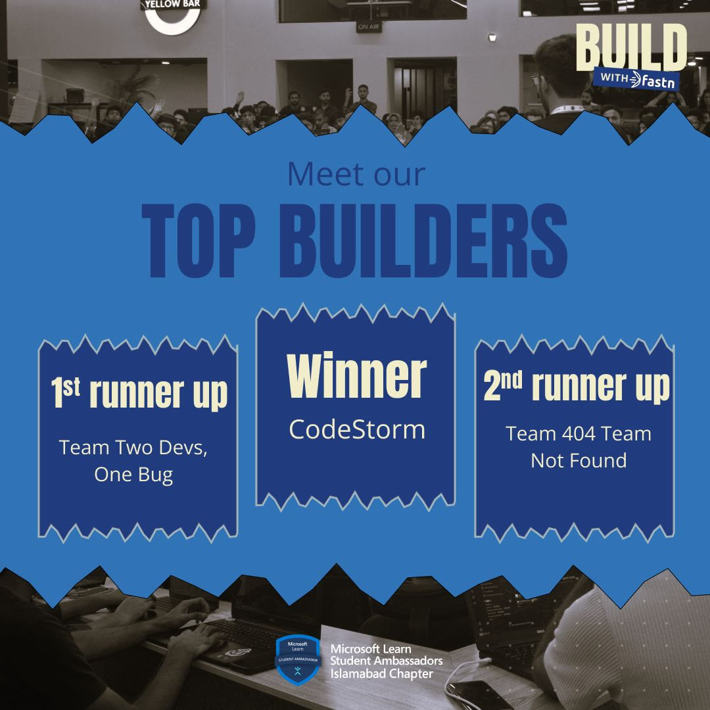
<br/>
<sub>Official results graphic © Microsoft Learn Student Ambassadors Islamabad Chapter / Fastn. Congratulations to <b>CodeStorm</b> (winner) and <b>Two Devs, One Bug</b> (1st runner-up).</sub>
</div>

<details>
<summary><b>About the organisers</b></summary>

<br/>

**Microsoft Learn Student Ambassadors (MLSA)** is Microsoft's global programme for student technologists who
build communities, run events and help their peers learn. The **Islamabad Chapter** organised this hackathon.

**Fastn** is an integration platform: ready-made connectors to SaaS apps, a JavaScript workflow runtime,
webhook and schedule triggers, an embeddable "connect your account" widget, and an **MCP server** that lets
an AI agent set all of that up.

</details>

<details>
<summary><b>How entries were judged (100 points)</b></summary>

<br/>

| Criterion | Points | What the judges looked for |
|---|:-:|---|
| Idea and innovation | 30 | Originality, whether the problem is real, creativity of the approach, clarity of the use case |
| Implementation and technical execution | 20 | Runs end to end; correct data flow; error handling; deduplication and conflict handling; workflow code quality |
| Submission | 20 | Working workflow link, demo video, README with setup steps, screenshots — submitted before the deadline |
| Use of the Fastn MCP tool | 20 | Connectors and connections set up through it, triggers bound, configs and widgets generated, workflow code produced and debugged with it |
| Demo video and framing | 10 | Clarity of the video, how well the problem is framed, the automation shown actually running |

</details>

---

## 👥 The team

**404 Team Not Found**

| Member | |
|---|---|
| **Abdul Raheem** | [@raheemxghumman](https://github.com/raheemxghumman) |
| **Wania Rahman** | |

---

## ❗ The problem

Pakistan's **Protection Against Harassment of Women at the Workplace Act 2010** obliges every employer to
maintain a three-member inquiry committee and to **complete an inquiry within 30 days** of a complaint.

The law is clear. The enforcement is not.

- A report lands in an inbox and **disappears** — no acknowledgement, no tracking.
- **Nothing happens when the deadline passes**, so people stop reporting.
- Case-management tools that solve this are enterprise-priced and built for US / EU law. A Pakistani employer
  has a spreadsheet at best.

**The gap is not a missing form. It is that nobody is watching the clock.**

---

## ✅ What Mehfooz does

Mehfooz turns the statutory deadline into a running system.

| # | Step | Where |
|:-:|---|---|
| 1 | A reporter files **anonymously** — no login, no name — and instantly gets a **case number** | Mehfooz app |
| 2 | A case record is created and the **statutory 30-day clock starts** | Notion |
| 3 | The inquiry committee is alerted with a **case link only** — never the description, never an email | Slack `#mehfooz-committee` |
| 4 | The reporter gets an acknowledgement (only if they gave an email; it is never written to the case record) | Gmail |
| 5 | **Day 23** → the committee is warned that 7 days remain | Slack |
| 6 | **Day 30** → **statutory breach**: the case is marked `Escalated` + `Breach` and the Competent Authority is alerted | Notion + Slack `#mehfooz-authority` |
| 7 | A formal notice goes to the **Federal Ombudsman (FOSPAH)** — case number, organization, dates, days overdue; no identities | Gmail |

> **The clock is the product.** Everything before it is a form. *The absence of action becoming an event* is
> the engineering.

**Customer-facing, twice:**

- **The reporter** — report form, case number, acknowledgement email, status tracking.
- **The employer** — connects **their own** Notion, Slack and Gmail through **Fastn's embedded widget, inline in
  the app, with no code**, then gets a report link locked to their organization.

---

## 🎬 Demo video

<div align="center">

[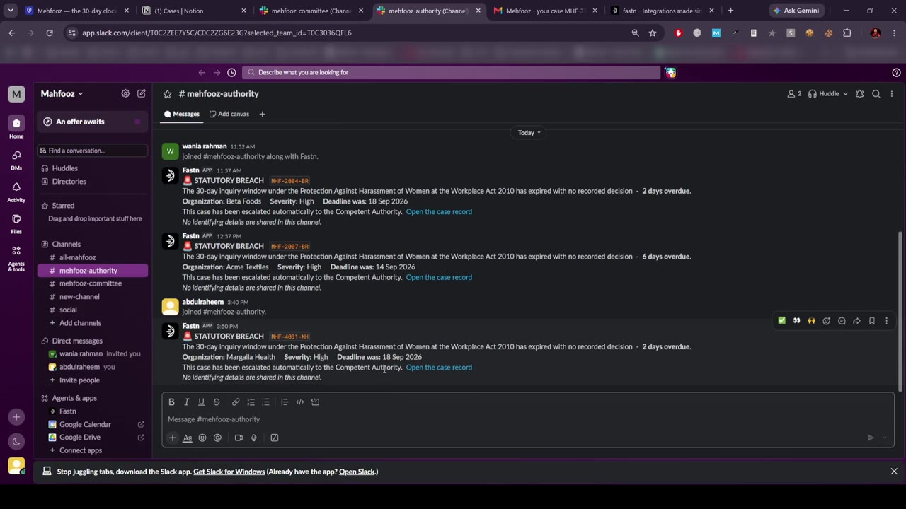](docs/demo/mehfooz-demo.mp4)

**[▶ Watch the demo (2:59)](docs/demo/mehfooz-demo.mp4)** &nbsp;·&nbsp; [download](../../raw/main/docs/demo/mehfooz-demo.mp4)

</div>

Recorded live on hackathon day against the real system: a report is filed → the Notion record, the Slack
committee alert and the Gmail acknowledgement appear → a case that passed day 30 is escalated by the clock **on
its own** → the Fastn traces and executions → employer onboarding through the embedded Fastn widget.

<sub>The published video has **no audio track**, and a personal inbox and the browser's bookmarks bar are blurred.</sub>

---

## 📸 Screenshots

### The app

<table>
<tr>
<td width="50%"><br/><sub><b>Landing</b> — light theme</sub></td>
<td width="50%">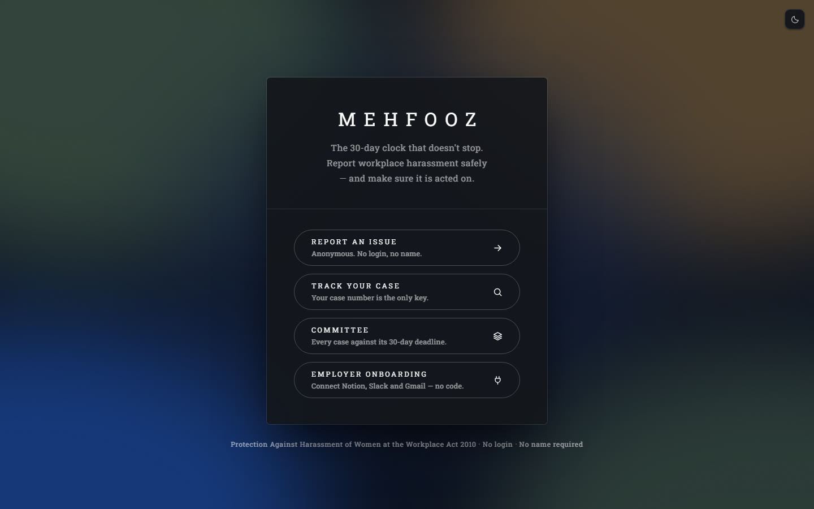<br/><sub><b>Landing</b> — dark theme</sub></td>
</tr>
<tr>
<td>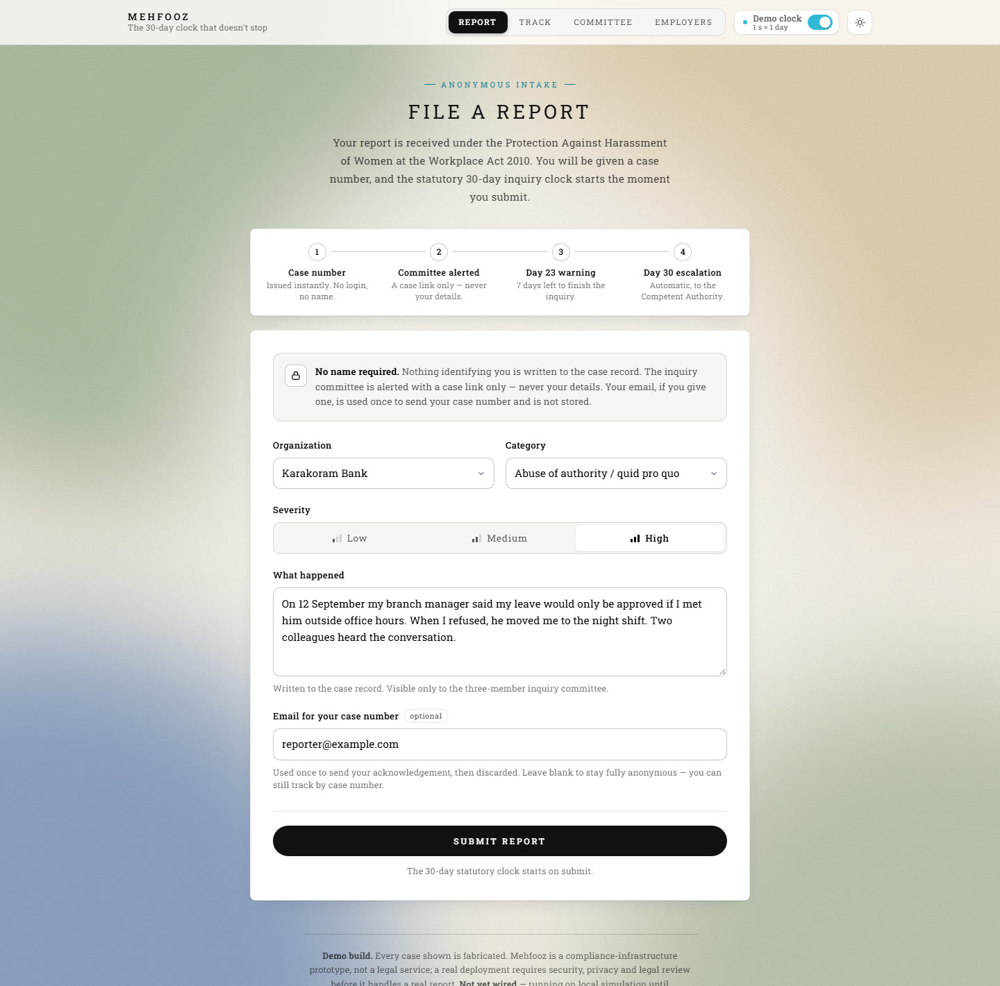<br/><sub><b>Report an issue</b> — anonymous intake, no login</sub></td>
<td>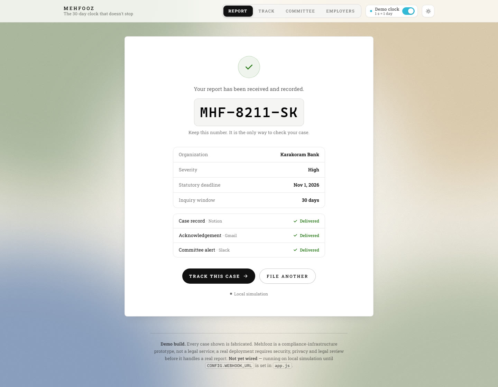<br/><sub><b>Receipt</b> — case number, statutory deadline, delivery status</sub></td>
</tr>
<tr>
<td>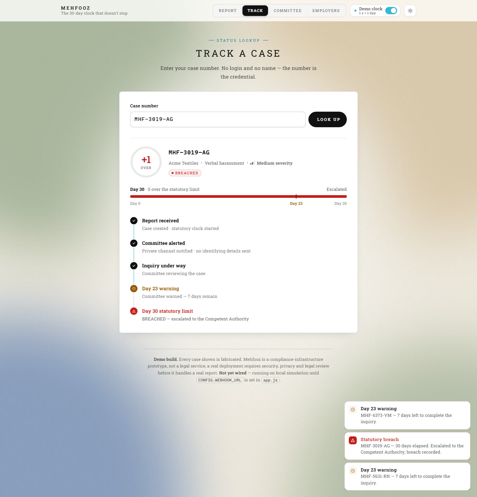<br/><sub><b>Track a case</b> — the case number is the only credential</sub></td>
<td>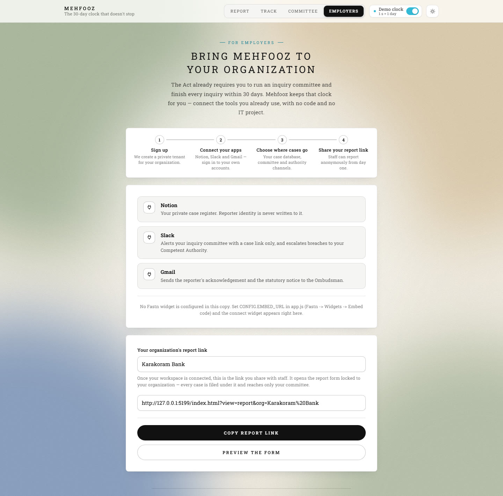<br/><sub><b>Employers</b> — onboarding and the organization's report link</sub></td>
</tr>
<tr>
<td>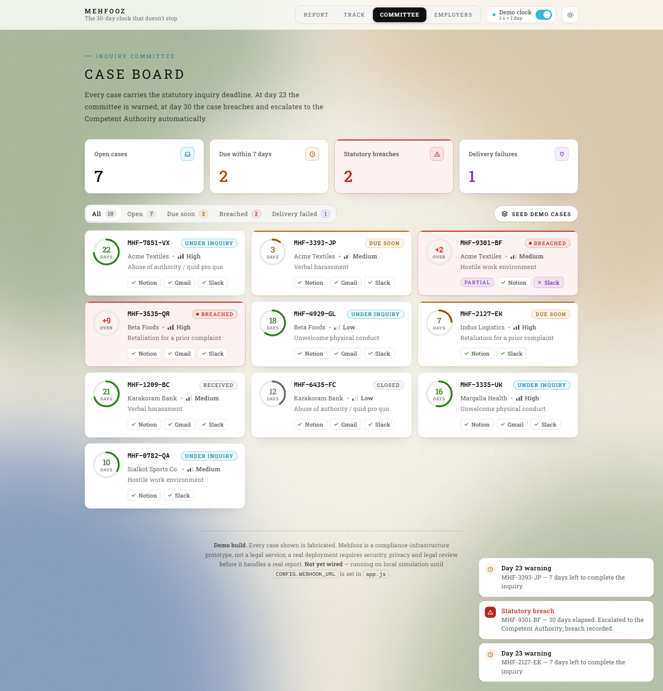<br/><sub><b>Committee board</b> — every case with its countdown ring</sub></td>
<td>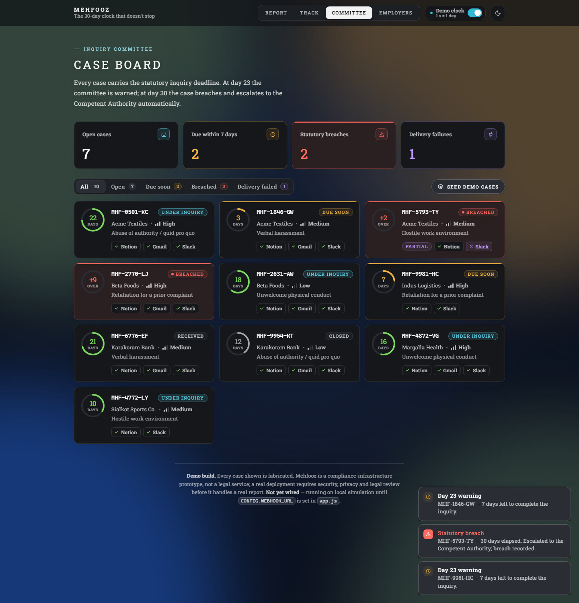<br/><sub><b>Committee board</b> — dark theme</sub></td>
</tr>
</table>

<sub>App screenshots were taken from this repository's copy, which runs as a local simulation (see <a href="#-run-it-locally">Run it locally</a>).</sub>

### The live system on hackathon day

<table>
<tr>
<td width="50%">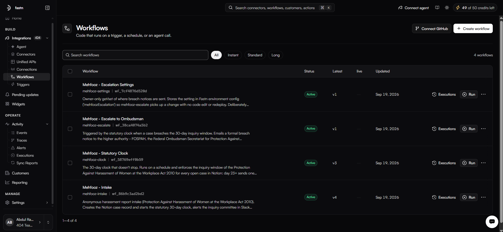<br/><sub><b>Fastn</b> — the four workflows</sub></td>
<td width="50%">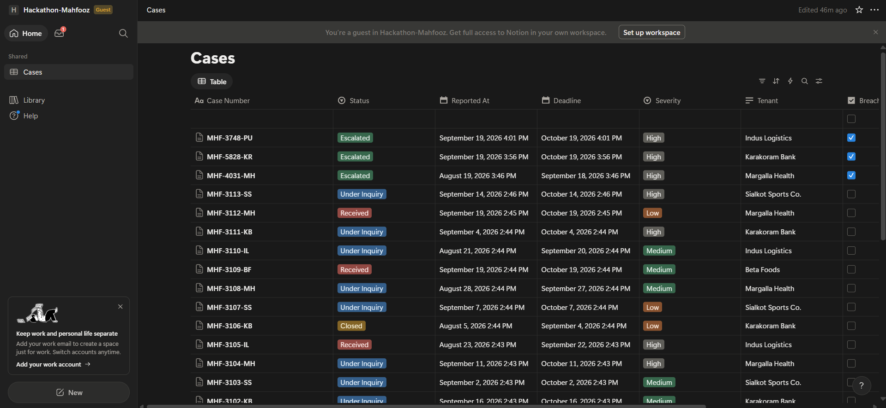<br/><sub><b>Notion</b> — the <code>Cases</code> database, the system of record</sub></td>
</tr>
<tr>
<td>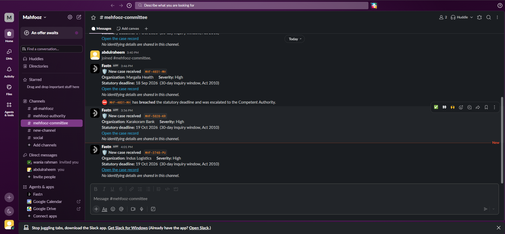<br/><sub><b>Slack <code>#mehfooz-committee</code></b> — alerts carry a case link only</sub></td>
<td>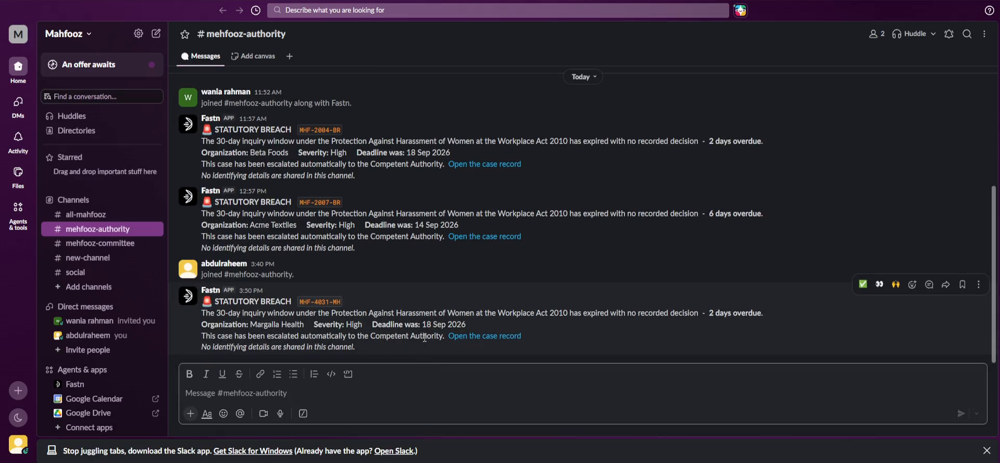<br/><sub><b>Slack <code>#mehfooz-authority</code></b> — statutory breaches, escalated automatically</sub></td>
</tr>
<tr>
<td>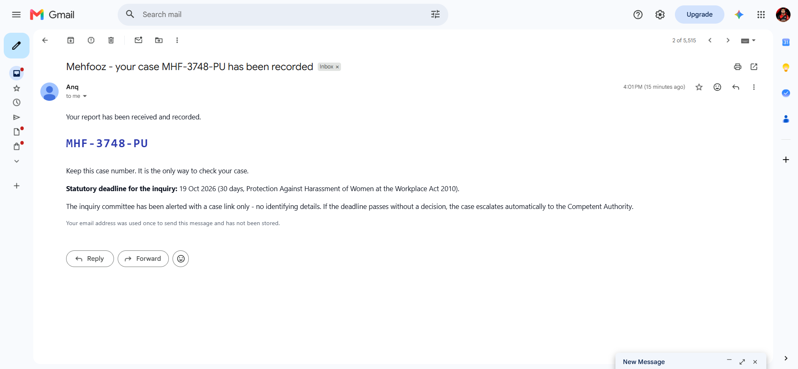<br/><sub><b>Gmail</b> — the reporter's acknowledgement</sub></td>
<td></td>
</tr>
</table>

---

## 🧩 Architecture

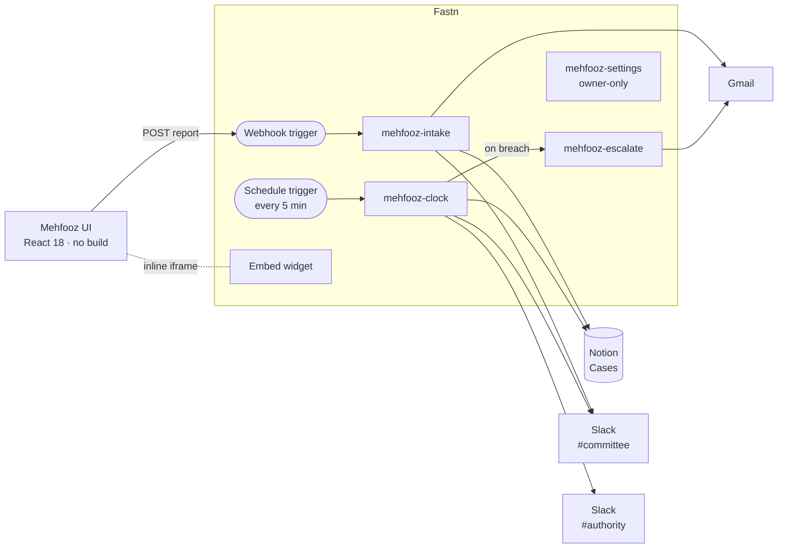
```mermaid
flowchart LR
    UI["Mehfooz UI<br/>React 18 · no build"]

    subgraph Fastn
        WH(["Webhook trigger"]) --> INTAKE["mehfooz-intake"]
        SCH(["Schedule trigger<br/>every 5 min"]) --> CLOCK["mehfooz-clock"]
        CLOCK -- "on breach" --> ESC["mehfooz-escalate"]
        SET["mehfooz-settings<br/>owner-only"]
        WIDGET["Embed widget"]
    end

    NOTION[("Notion<br/>Cases")]
    SLACKC["Slack<br/>#committee"]
    SLACKA["Slack<br/>#authority"]
    GMAIL["Gmail"]

    UI -- "POST report" --> WH
    UI -. "inline iframe" .- WIDGET
    INTAKE --> NOTION
    INTAKE --> SLACKC
    INTAKE --> GMAIL
    CLOCK --> NOTION
    CLOCK --> SLACKC
    CLOCK --> SLACKA
    ESC --> GMAIL
```

**Four workflows, two triggers, three connectors, one widget.** The browser only ever talks to the webhook — it
holds no API key and no credential.

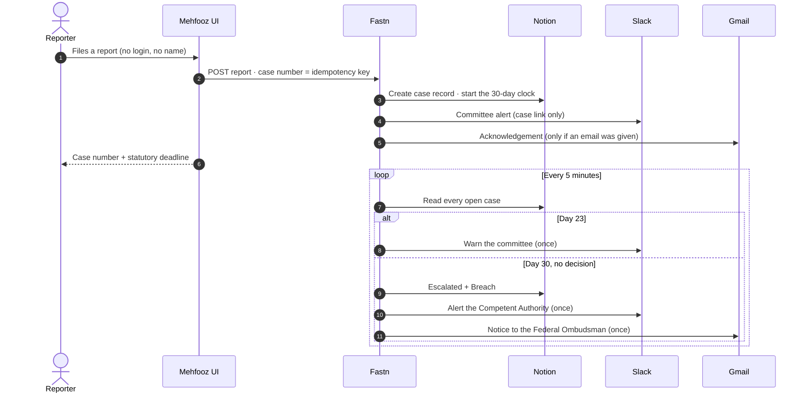
```mermaid
sequenceDiagram
    autonumber
    actor R as Reporter
    participant UI as Mehfooz UI
    participant F as Fastn
    participant N as Notion
    participant S as Slack
    participant G as Gmail

    R->>UI: Files a report (no login, no name)
    UI->>F: POST report · case number = idempotency key
    F->>N: Create case record · start the 30-day clock
    F->>S: Committee alert (case link only)
    F->>G: Acknowledgement (only if an email was given)
    UI-->>R: Case number + statutory deadline

    loop Every 5 minutes
        F->>N: Read every open case
        alt Day 23
            F->>S: Warn the committee (once)
        else Day 30, no decision
            F->>N: Escalated + Breach
            F->>S: Alert the Competent Authority (once)
            F->>G: Notice to the Federal Ombudsman (once)
        end
    end
```

📖 Full details — data model, state keys, the clock's rules, the multi-tenant design:
**[`docs/ARCHITECTURE.md`](docs/ARCHITECTURE.md)**

---

## ⚙️ Built on Fastn

### The workflows

| Workflow | Trigger | What it does | Source |
|---|---|---|---|
| `mehfooz-intake` | **Webhook** (public, async) | Validate → de-duplicate → start the clock → Notion record → Slack alert → Gmail acknowledgement → settle the delivery status | [`mehfooz-intake.js`](workflows/mehfooz-intake.js) |
| `mehfooz-clock` | **Schedule** `*/5 * * * *` | Retry failed alerts · day-23 warning · day-30 breach and escalation | [`mehfooz-clock.js`](workflows/mehfooz-clock.js) |
| `mehfooz-escalate` | Called by the clock | Formal breach notice to the Federal Ombudsman, once per case | [`mehfooz-escalate.js`](workflows/mehfooz-escalate.js) |
| `mehfooz-settings` | None — owner-only | Where breach notices go: a `demo` inbox or the real `fospah` address | [`mehfooz-settings.js`](workflows/mehfooz-settings.js) |

### Fastn primitives used

| Fastn primitive | How Mehfooz uses it |
|---|---|
| **Connectors** (3) | Notion · Slack · Gmail. OAuth, token refresh and API plumbing are Fastn's job. |
| **Triggers** (2) | A public **webhook** lets an anonymous browser form reach a workflow with no API key. A **schedule** *is* the 30-day clock. |
| **Workflows** (4) | Validation, de-duplication, privacy rules, retry and escalation logic, in Fastn's JavaScript sandbox. |
| **`fastn.state`** | Idempotency keys and "already warned / escalated / notified" markers. |
| **`fastn.envConfig`** | The escalation recipient is a setting, not code. |
| **`fastn.flow.invoke`** | The clock hands a breach to the escalation workflow. |
| **Embed widget + tenants** | An employer connects their own apps with no code; rendered inline on the Employers page. |
| **Test cases + validation** | Acceptance cases approved *before* each build, attached to the workflows, results saved. |

### Driven through the Fastn MCP

The whole backend was built from an AI coding assistant connected to **Fastn's MCP server** — not by clicking
through the dashboard.

| The brief asked for | What was done through the MCP |
|---|---|
| Connectors and connections set up through it | Read the connector contracts; minted secure connect links; re-authorised Gmail with a **reduced scope** to get past Google's block; verified the connections |
| Triggers bound | Bound the webhook and the schedule; fired the scheduler on demand; correlated every fire to its execution by event id |
| Configs generated | The `mehfoozEscalation` environment setting, written by the validated `mehfooz-settings` workflow |
| Widgets generated | Created the embed widget, a demo tenant and setup links for employer onboarding |
| Workflow code produced | Probed live before saving; created, published, updated and patched all four workflows |
| …and debugged with it | Read execution traces; replayed saved test cases; saved validation results |

**Three real bugs, found and fixed with it:**

1. **Executions stuck in `queued`.** On the `standard` tier the queue never drained, so the schedule *looked*
   armed and never ran. Found in the execution list; fixed by moving to the `instant` tier.
2. **Browser blocked by CORS.** The webhook answers preflights without `Access-Control-Allow-Origin`. Fixed by
   posting a CORS "simple request" (`text/plain`); verified Fastn still parses the body as JSON.
3. **Notion schema could not be created by API.** The connector's create / update database actions hard-code a
   single column. Worked around by addressing columns by **property id**, which is also rename-proof.

---

## 🛡️ Reliability — it never fails silently

| Failure | What happens |
|---|---|
| **Duplicate submission** | The case number is the idempotency key — a repeat is dropped in ~100 ms with **zero connector calls** |
| **Bad input** | Rejected before any connector is called, naming the exact fields |
| **Slack down at intake** | No crash. The case is recorded and marked `PARTIAL` |
| **Retry** | The clock re-sends failed alerts every tick and heals `PARTIAL → OK`; after 3 failures → `FAILED` + a manual-action alert |
| **Notion down at intake** | `record_failed`; the committee is still alerted; no email falsely claims the case was recorded |
| **Slack down at breach** | Notion is updated **first**, so a lost alert is retried next tick, never forgotten |
| **The clock ticks forever** | Every warning, escalation and Ombudsman notice is sent **exactly once** |

The Slack-outage path was proven against a **real** outage on the first live run, not a mock.

---

## 🔒 Privacy and security

- **Slack gets a link only** — never the description, never an email. The full account stays in the case record,
  which only the inquiry committee can open.
- **No column for the reporter exists.** The reporter's email is optional, used once, and never written to
  Notion, Slack or workflow state.
- **The clock cannot be tampered with through the open webhook.** Back-dating (used to stage a breach on camera)
  is honoured only in `demo` mode and fails closed; a caller's timestamp is accepted only within 10 minutes of
  the server's time.
- **A fabricated case can never reach a real authority by accident.** `fospah` mode refuses to switch on without
  a deliberately supplied address.
- **Nothing secret is in this repository.** The webhook URL, embed token, Notion database id and inboxes are
  placeholders.

Mehfooz does not judge or punish. A report opens an inquiry under the Act, where the accused responds; the
committee can close an unfounded case and the clock stops.

---

## 🧪 Testing

Every workflow was built **test-first**: acceptance cases were drafted, reviewed and approved by a human
*before* the code was written.

| | |
|---|---|
| Acceptance cases approved | **41** |
| Verified live against the real Notion, Slack and Gmail | **34** |
| Skipped, with the reason written down | **7** — forced third-party outages that could not be induced without sabotaging live connections |
| Failing | **0** |
| Workflow executions, hackathon day through 21 Sep 2026 | **≈ 500**, with **zero failed runs** |

📋 Every case, its pass condition and its result: **[`docs/TEST-CASES.md`](docs/TEST-CASES.md)**

---

## 🚀 Run it locally

The app in this repository runs out of the box as a **faithful local simulation** — the webhook URL is left
empty, so nothing leaves your browser and cases are stored in `localStorage`.

**Windows**

```bat
git clone https://github.com/raheemxghumman/mehfooz.git
cd mehfooz
run.bat
```

**macOS / Linux**

```bash
git clone https://github.com/raheemxghumman/mehfooz.git
cd mehfooz/ui
python3 -m http.server 5173
```

Then open **<http://localhost:5173>**. No install, no build step, no CDN — React 18 is vendored in `ui/vendor/`.

### Useful links

| URL | What it shows |
|---|---|
| `/index.html` | Landing page |
| `/index.html?view=report` | Report form |
| `/index.html?view=board&seed=1` | Committee board with demo cases |
| `/index.html?view=track` | Track a case |
| `/index.html?view=employers` | Employer onboarding |
| `/index.html?view=report&org=Karakoram+Bank` | Report form locked to one organization |
| `…&theme=dark` · `…&theme=light` | Force a theme |
| `…&demo=1` | Presenter control: file a report as if it were 24 or 31 days old |

### Go live

To connect a real Fastn backend with your own Notion, Slack and Gmail, follow
**[`docs/SETUP.md`](docs/SETUP.md)** — nine steps, reproducible from scratch.

---

## 📁 Repository structure

```text
mehfooz/
├── README.md
├── run.bat                      Serve the UI on http://localhost:5173 (Windows)
├── .mcp.json                    Fastn MCP server config for an AI client
│
├── ui/                          The app — static, no build step
│   ├── index.html
│   ├── app.js                   React 18 + htm; CONFIG block at the top
│   ├── styles.css
│   ├── orgs.js                  Organization registry
│   └── vendor/                  React, ReactDOM, htm, Roboto Slab (vendored)
│
├── workflows/                   The Fastn backend
│   ├── mehfooz-intake.js        Webhook  → Notion + Slack + Gmail
│   ├── mehfooz-clock.js         Schedule → warn, breach, escalate, retry
│   ├── mehfooz-escalate.js      Breach   → notice to the Ombudsman
│   ├── mehfooz-settings.js      Owner-only escalation setting
│   └── README.md
│
└── docs/
    ├── ARCHITECTURE.md          Components, data model, clock rules, multi-tenant design
    ├── SETUP.md                 Reproduce it from scratch
    ├── TEST-CASES.md            All acceptance cases and results
    ├── demo/                    Demo video (muted) and poster
    ├── screenshots/             App screens and the live system
    └── award/                   Official results graphic
```

---

## ⚠️ Limitations

We would rather you hear these from us.

- **A prototype, not a legal service.** Every case shown is fabricated. A real deployment needs security,
  privacy and legal review. We are not lawyers; our reading of the Act should be verified.
- **Single-tenant today.** One Notion, one Slack, one Gmail (Fastn's free plan allows three connected accounts).
  The organization is a column on the case. Per-employer isolation is a design, described in
  [`ARCHITECTURE.md`](docs/ARCHITECTURE.md#employer-onboarding--the-multi-tenant-design), not something that ran.
- **The app's Track page and Committee board read the browser's local storage**, on a demo clock (1 second = 1
  day). The authoritative clock is the Fastn workflow reading Notion. A reporter on another device cannot yet
  look up her case.
- **The receipt's delivery ticks are optimistic.** The webhook is fire-and-forget, so the browser cannot read
  the result; the true delivery status lives on the Notion record.
- **Anonymous reports have limits.** An anonymous report can put an incident on record and start fact-finding,
  but there is no way yet for the committee to ask the reporter a follow-up question.
- **The intake webhook is open** so an anonymous form can reach it. Production needs rate-limiting and a CAPTCHA.
- **Fastn's execution log retains the raw webhook input.** Production would enable body redaction.
- **Seven failure-path cases were never induced live** — see [`TEST-CASES.md`](docs/TEST-CASES.md).

---

## 🗺️ Roadmap

- [ ] Real multi-tenancy — per-employer connections, configuration and state
- [ ] A status-lookup endpoint, so *Track a case* works from any device
- [ ] A two-way anonymous message thread, keyed by case number
- [ ] Rate-limiting and a CAPTCHA on intake; staff-only report links
- [ ] Private Slack channels addressed by id
- [ ] Urdu interface

---

## 🙏 Acknowledgements

- **Microsoft Learn Student Ambassadors — Islamabad Chapter**, for organising the hackathon.
- **Fastn**, for the platform, the MCP server and the mentors on the day.
- **SEECS, NUST**, for hosting.
- The app vendors [React](https://react.dev) and [htm](https://github.com/developit/htm), and the
  [Roboto Slab](https://fonts.google.com/specimen/Roboto+Slab) typeface, each under its own licence.

<div align="center">
<br/>

**404 Team Not Found** &nbsp;·&nbsp; Abdul Raheem &nbsp;·&nbsp; Wania Rahman

*A law with a deadline finally has a clock.*

</div>
