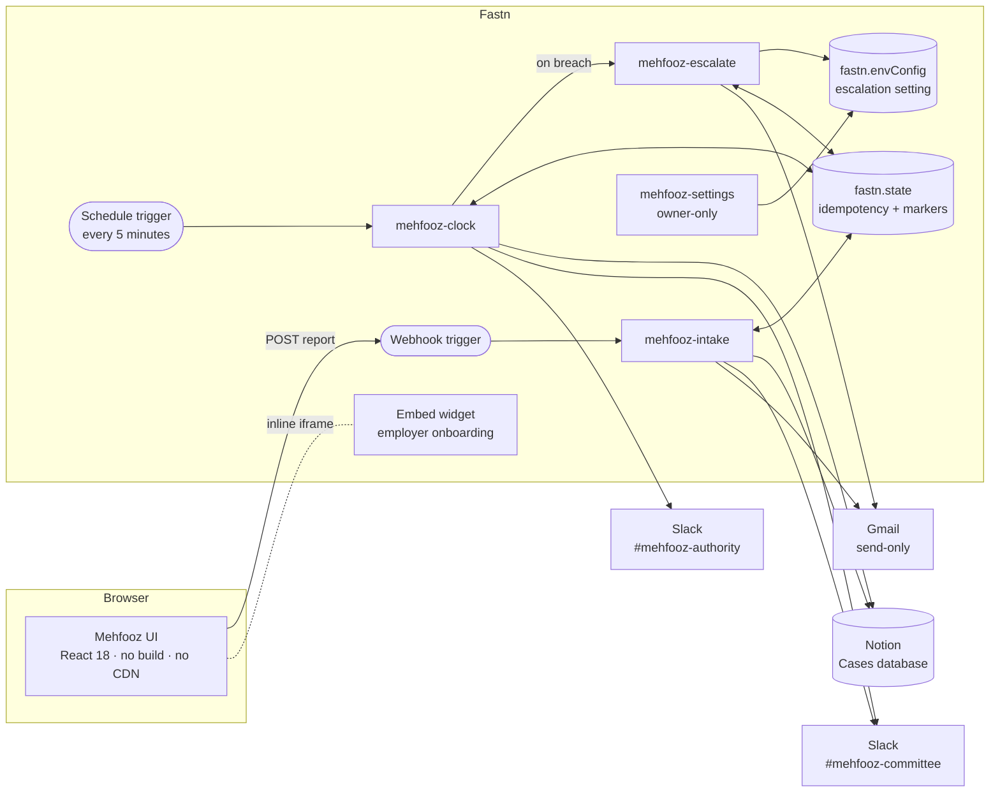
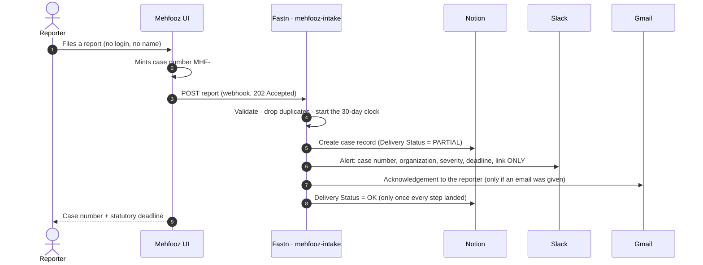
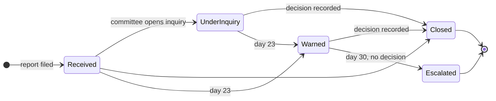

# Architecture

How Mehfooz is put together: the components, the data, and the rules that make it reliable and private.

- [System overview](#system-overview)
- [Life of a case](#life-of-a-case)
- [The statutory clock](#the-statutory-clock)
- [Data model](#data-model)
- [Reliability — it never fails silently](#reliability--it-never-fails-silently)
- [Privacy and security](#privacy-and-security)
- [Employer onboarding — the multi-tenant design](#employer-onboarding--the-multi-tenant-design)

---

## System overview



**Four workflows, two triggers, three connectors, one widget.** The browser only ever talks to the webhook; it
holds no API key and no credential.

| Component | Role |
|---|---|
| **UI** ([`ui/`](../ui)) | Static React 18 app (vendored, no build step). Landing, report form, case tracking, committee board, employer onboarding. |
| **`mehfooz-intake`** | Turns one anonymous report into a case record, a committee alert and an acknowledgement. |
| **`mehfooz-clock`** | The product. Enforces the 30-day window and retries failed deliveries. |
| **`mehfooz-escalate`** | Sends the formal breach notice to the Federal Ombudsman (FOSPAH). |
| **`mehfooz-settings`** | Owner-only switch for where breach notices go. |
| **Notion** | The system of record. |
| **Slack** | Two audiences, two channels: the inquiry committee and the Competent Authority. |
| **Gmail** | The reporter's acknowledgement and the Ombudsman notice. |

---

## Life of a case



The intake workflow runs seven steps in a fixed order:

1. **Validate** — before *any* connector call. Bad input is rejected naming the exact fields.
2. **De-duplicate** — the case number is the idempotency key (`fastn.state`).
3. **Start the clock** — on the **server's** time.
4. **Record** — Notion case record, written pessimistically as `PARTIAL`.
5. **Alert** — Slack message to the committee with a case link only.
6. **Acknowledge** — Gmail, only if the reporter asked for it and only if the record really exists.
7. **Settle** — promote to `OK` only when every step landed; otherwise leave `PARTIAL` for the retry worker.

---

## The statutory clock



A Fastn **schedule trigger** runs `mehfooz-clock` every five minutes. On each tick, for every open case:

| Condition | Action | Sent at most |
|---|---|---|
| `Delivery Status = PARTIAL` and the committee alert failed | Re-send the alert; heal the case to `OK` | Up to 3 attempts, then `FAILED` + a manual-action alert to the Authority |
| Day ≥ 23 | Warn the committee that 7 days remain | **Once** per case |
| Day ≥ 30 | Notion → `Escalated` + `Breach` **first**, then alert the Competent Authority | **Once** per case |
| Day ≥ 30 | Invoke `mehfooz-escalate` → formal notice to the Ombudsman | **Once** per case |
| `Status = Closed`, or a blank row | Skip | — |

The clock is **idempotent**: it can tick forever and never repeat an action. A second tick over the same data
performs zero writes.

> *"The absence of action became an event."* Everything before the clock is a form. The clock is the product.

---

## Data model

### Webhook payload (UI → Fastn)

```json
{
  "caseNo": "MHF-2605-CR",
  "tenant": "Karakoram Bank",
  "category": "Abuse of authority / quid pro quo",
  "severity": "Low | Medium | High",
  "description": "…",
  "reporterEmail": "… or null",
  "reportedAt": "ISO-8601",
  "backdateDays": 0
}
```

- `caseNo` is minted in the browser and is the **idempotency key**.
- `reportedAt` is accepted only within **10 minutes** of the server's time.
- `backdateDays` exists only to stage demos and is honoured **only in `demo` mode**.

### Notion database `Cases`

| Column | Type | Written by |
|---|---|---|
| Case Number | title | intake |
| Status | select — `Received` · `Under Inquiry` · `Escalated` · `Closed` | intake → clock (`Escalated`) · committee (`Under Inquiry`, `Closed`) |
| Severity | select — `Low` · `Medium` · `High` | intake |
| Tenant | text | intake |
| Reported At | date | intake |
| Deadline | date (`Reported At + 30 days`) | intake |
| Breach | checkbox | clock |
| Delivery Status | select — `OK` · `PARTIAL` · `FAILED` | intake → clock retry worker |
| *(page body)* | category + description | intake |

There is deliberately **no column for the reporter**. Columns are addressed by Notion property **id**, so
renaming a column never breaks a workflow.

### Workflow state (`fastn.state`)

| Key | Purpose |
|---|---|
| `mehfooz:case:<caseNo>` | Duplicate guard, per-system delivery result, Slack retry count |
| `mehfooz:warned:<pageId>` | The day-23 warning was sent — never send it twice |
| `mehfooz:escalated:<pageId>` | The breach escalation was delivered — never send it twice |
| `mehfooz:ombudsman:<caseNo>` | The Ombudsman notice was sent — never send it twice |

### Escalation setting (`fastn.envConfig`, key `mehfoozEscalation`)

```json
{ "mode": "demo | fospah", "demoEmail": "…", "fospahEmail": "…" }
```

Where the Ombudsman notice goes is **a setting, not code**. `demo` mode sends it to a demo inbox, marked
`[DEMO]`. `fospah` mode sends the real notice and **refuses to switch on until an address is deliberately
supplied** — a fabricated case can never reach a real authority by accident.

---

## Reliability — it never fails silently

| Failure | What happens |
|---|---|
| **Duplicate submission** (double-click, webhook redelivery) | Dropped in ~100 ms with **zero connector calls**. No second case, alert or email. |
| **Bad input** | Rejected before any connector is called, naming the exact fields. |
| **Slack down at intake** | The workflow does not throw. The case is recorded and marked `PARTIAL`. |
| **Retry** | The clock re-sends failed alerts each tick and heals `PARTIAL → OK`. |
| **Slack still down after 3 attempts** | Case marked `FAILED`; the Competent Authority is told to act manually. |
| **Notion down at intake** | `record_failed`. The committee still gets a *manual action required* alert, no email falsely claims the case was recorded, and the dedupe key is released so an honest resubmission goes through. |
| **Slack down at breach** | Notion is updated **before** Slack (record of truth first), so the lost alert is retried next tick, never forgotten. |
| **Gmail down at escalation** | No "sent" marker is written, so the clock re-attempts the Ombudsman notice next tick. |
| **One bad row in Notion** | Skip-on-error: the row is reported in `errorDetails`; every other case is still processed. |

The Slack-outage path was proven against a **real** outage, not a mock: our first live run hit Slack's
`channel_not_found`, the case was recorded as `PARTIAL`, and the retry worker healed it. The Notion-down,
Gmail-down and three-strikes paths could not be induced live (Fastn has no mock stubs for these connectors);
they are code-reviewed and recorded as skipped in [`TEST-CASES.md`](TEST-CASES.md).

---

## Privacy and security

- **Slack gets a link only.** Case number, organization, severity, deadline, link — never the description, never
  an email. Slack channels are searchable and notifications appear on lock screens.
- **The full account stays in the case record**, which only the inquiry committee can open.
- **The reporter's email is optional and single-use.** It is not written to Notion, Slack or workflow state.
- **The clock cannot be tampered with through the open webhook.** Back-dating is honoured only in `demo` mode
  and fails closed if the setting cannot be read; a caller's timestamp is accepted only within 10 minutes of
  server time; the 30-day window is a constant.
- **User text is escaped** before it reaches Slack.
- **`mehfooz-settings` has no public trigger.**

**Known gaps** (see the README's *Limitations*): Fastn's execution log retains the raw webhook input, so
production must enable body redaction; the intake webhook is unauthenticated and needs rate-limiting and a
CAPTCHA.

---

## Employer onboarding — the multi-tenant design

**What runs today is single-tenant.** All four workflows use one Notion workspace, one Slack workspace and one
Gmail account; the organization is a text column on the case. Fastn's free plan allows three connected
accounts and one employer uses all three.

**How a real employer would join — Fastn's tenant model, with no code on their side:**

| # | The employer | Fastn |
|---|---|---|
| 1 | Signs up on the Mehfooz portal | A **tenant** is created under our organization |
| 2 | Opens *Connect your workspace* — the page **embeds the Fastn widget** | The widget opens with a token scoped to that tenant |
| 3 | Clicks **Connect** for Notion, Slack and Gmail and signs in to *their own* accounts | Stores and refreshes the tokens **per tenant** — Mehfooz never sees a credential |
| 4 | Picks their case database, committee channel and authority channel | Saves them as that tenant's configuration |
| 5 | Shares their report link with staff | Runs the same workflows with that employer's connections |

The **report link** carries the organization (`index.html?view=report&org=Karakoram+Bank`) and locks the form
to it, so staff never pick their employer from a list and a new employer needs no redeploy.

**What would change to ship it:** flip the three connectors to `MULTI_TENANT` in the workflow manifest; replace
the hard-coded database id and channel names with per-tenant configuration; carry the tenant on the intake
link; namespace the `fastn.state` keys per tenant. The workflow logic itself does not change.
